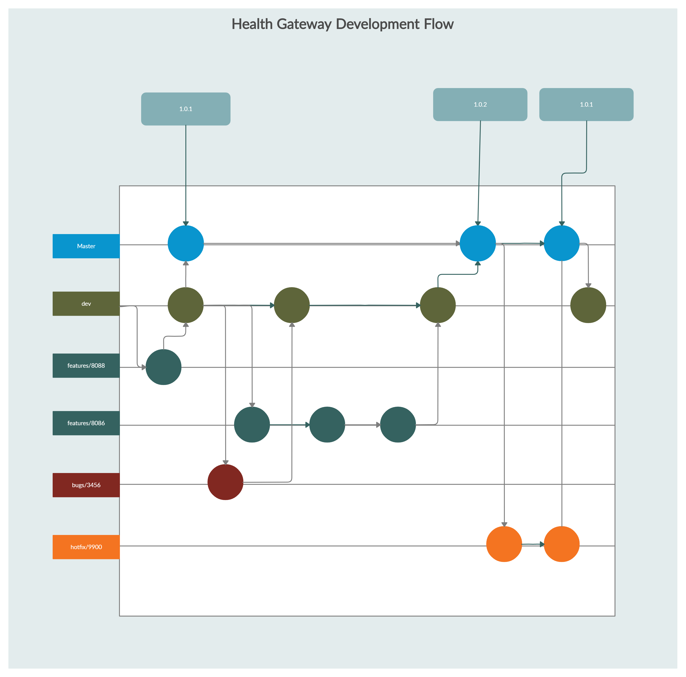

# Git and Azure Development processes

## Git Commits

Every commit into GitHub should have a reasonable comment and should make reference to the Azure DevOps work item number.  

```console
git commit -m "Completed refactor work on Immunizations API for AB#nnnn"
```

## Branching Workflow

The Health Gateway team primarily follows the GitFlow branching model as [documented](https://www.atlassian.com/git/tutorials/comparing-workflows/gitflow-workflow).

Many branches are named with a /nnnn suffix, this suffix represents the Azure DevOps work item that is used for Sprint tracking.



### master

The master branch reflects the code that has been migrated to Production.
A PR with at least two approvals is required to merge into master.

### dev

The primary work branch for the Health Gateway team.  This branch should always be head of the master branch.
At the end of a Sprint, the dev branch must be merged into master.
If/When a hotfix is applied to master, then a merge from back to dev must occur.
A PR with at least two approvals is required to merge into dev.  We are striving to have more than 2 reviewers per PR and the identified code owners should be considered mandatory (you shouldn't merge without good reason).

A build is intiated automatically in Azure DevOps for any commit.  A release must be manually triggered to deploy the new build into the dev environment.

### features/nnnn

For any task in the current sprint, a feature branch must be created.  this new branch can be worked on by one or more teams members and at the end of feature development, a PR is created to merge the feature into dev.

### bugs/nnnn

For any bug work within a Sprint, a bugs branch should be created and subsequently merged into dev.

### hotfix/nnnn

If a high priority Production change is requested by our Product Owner, then a hotfix branch will be created and subsequently merged directly into master.  Once the merge to master occurs, a merge into dev should also be initiated.

A manual build must be triggered for a hotfix and the build source branch must be edited.  Once the build has completed, the build number should be used when creating the Azure Release.  Only the changed applications should be updated and the list of application should be verified against the current Azure release.
