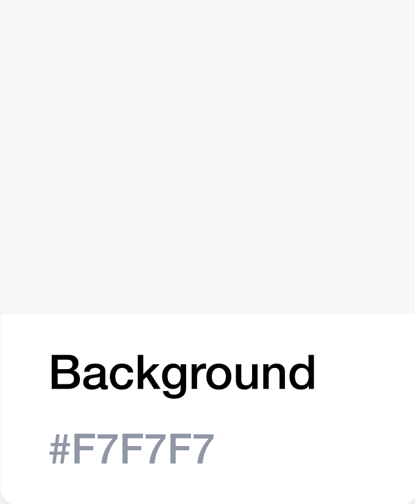
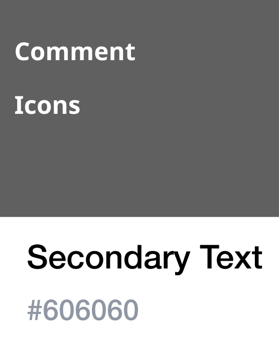

# Design System

The Design System helps developers and designers build better digital products and services

## Header

Headers help people understand what the product or service is about while providing a consistent look, feel, and functionality across government sites.
BC vertical logo is used for tablet and mobile header.
height of the heaeder is **fixed** and **65px** on all devices.


### Typography

BC Sans is an open source font family, and is a modified version of Noto Sans, developed by Google. BC Sans includes modifications to support Indigenous languages in British Columbia.

-   BC Sans Regular - 400
-   BC Sans Italic - 400
-   BC Sans Bold - 700
-   BC Sans Bold Italic - 700

### Colour Palette

The B.C. Government colour palette ensures all public facing government services have consistent branding

#### Brand Colours

<p float="left">
    
    
    
    
</p>

#### State Colours

<p float="left">
    
    
    
    
    
    

</p>

```
Primary #003366
Secondary #0092F1
Success #2E8540
Error #D72E3D
Heading Text #313132
Input Text #606060
Accent #FCBA19
Links #1A5A96
Navigation Bar #38598A
Secondary Text #606060
Background #F7F7F7
```

### Buttons

Buttons are categorized and used as follow:
Primary


### Icons

Sizing of icons


## Typography

typeface and sizing

