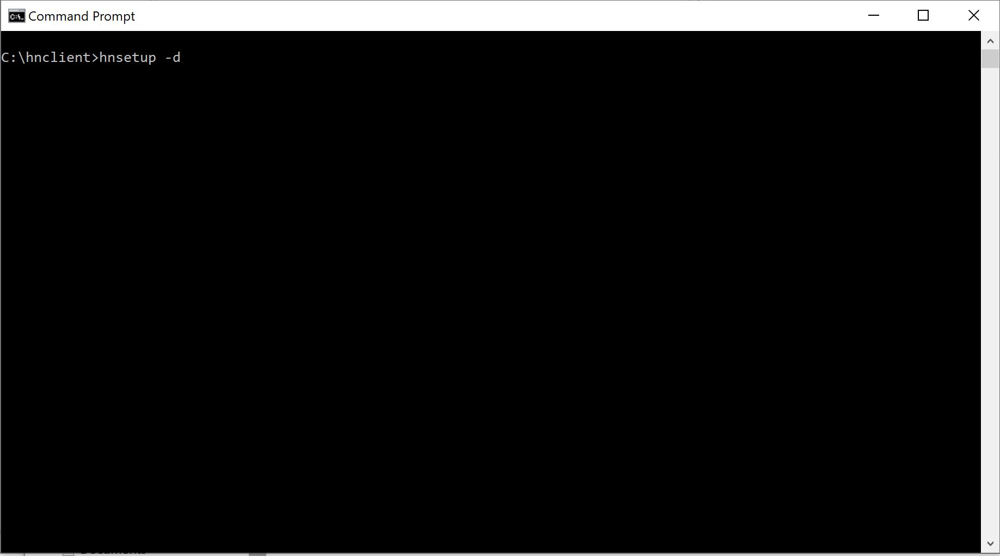
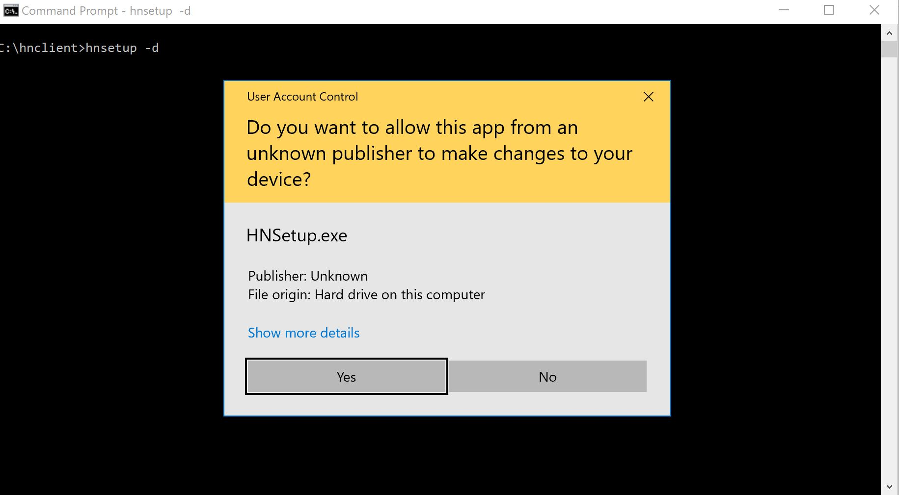
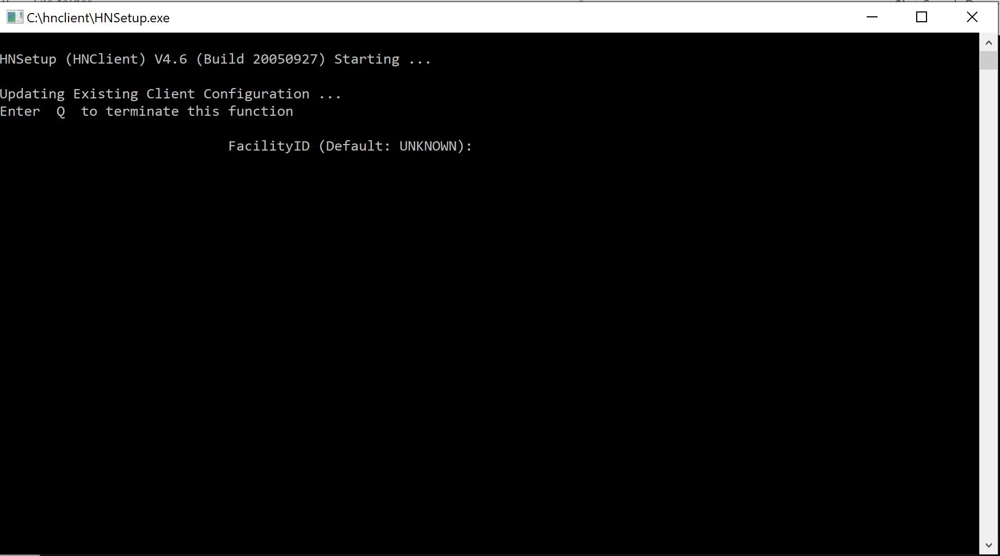
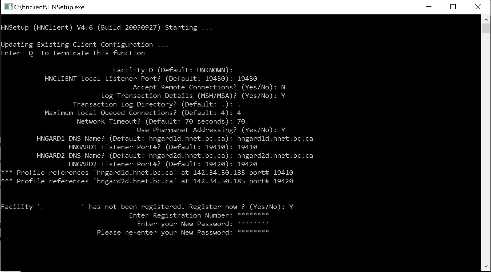
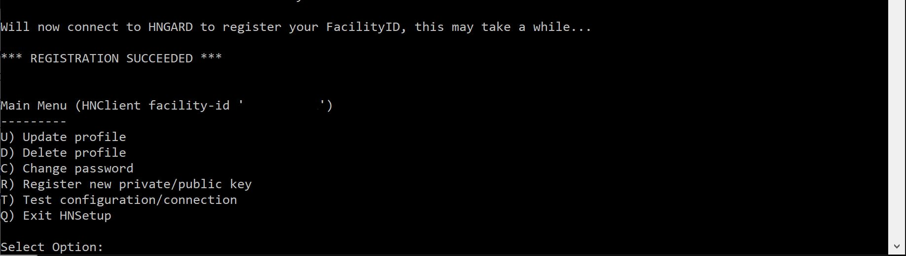

# Development HNClient Setup

## Preequisites

Ensure your computer hostname is 8 characters or less

## Configure and Verify HNClient

### Step 1 - Run HNSetup

Open a command window and run

``` bash
hnsetup -d
```



### Step 2 - Accept Windows Warning

Accept the Windows prompt to allow changes to your computer from an unknown publisher.



### Step 3 - Enter Facility ID

Enter your facility ID when requested and hit enter.



### Step 4 - Configuration

Answer each of the configuration questions as shown below.

When prompted to Register Now, answer `Y`.

Enter and confirm a password.



### Step 5 - Exit Setup

Enter `Q` to exit the setup program.



### Step 6 - Run HNClient

Open a new console window and change to the folder where HNClient exists.

Run `HNClient` and enter your password when prompted.


### Step 7 - Verify HNClient

Return to your original command line window and run 

``` bash
hntimecl D BC00001000
```


