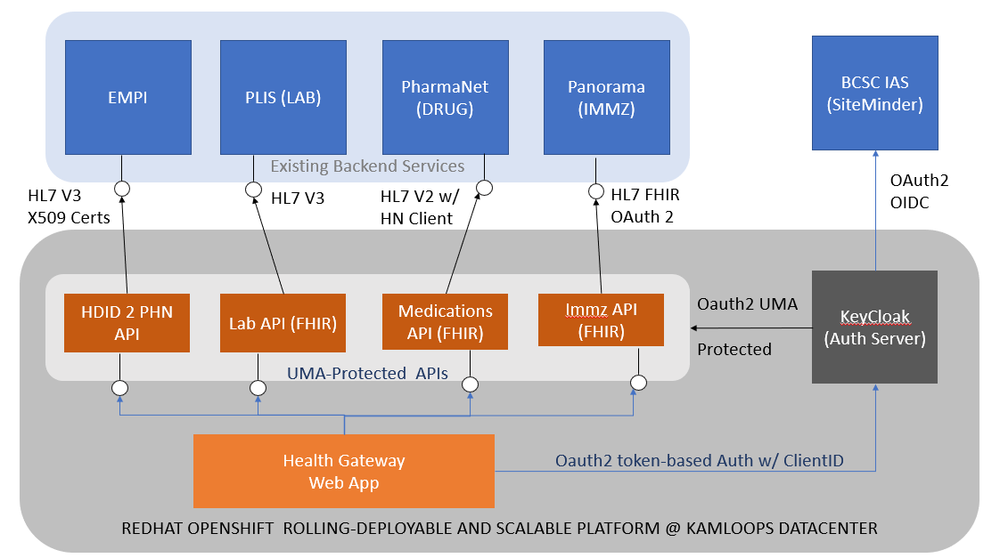
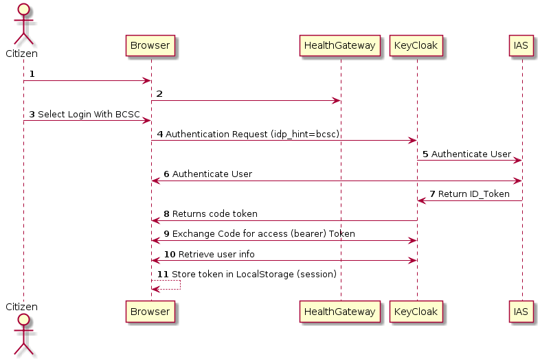
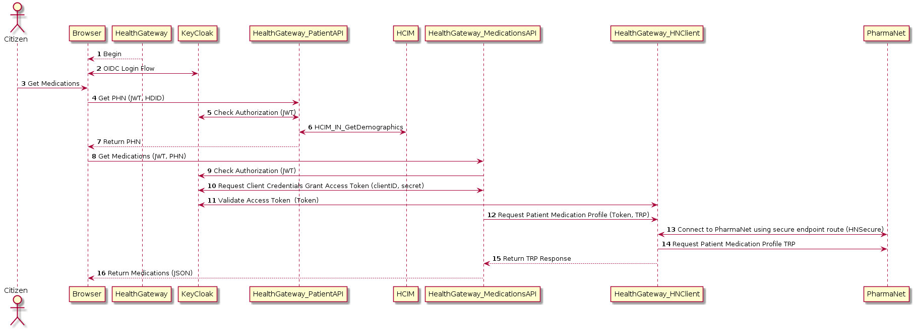
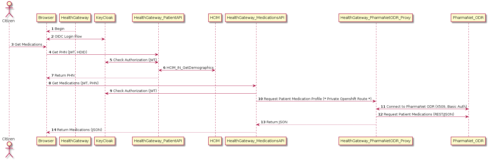

# High-Level HealthGateway Architecture

## Accessing Existing Health Services

* HealthGateway connects to the Healthcare Client Identity Management System (HCIM), an implementation of IBM/Initiate's Enterprise Master Patient Index to support resolving the subject's Personal Health Number given a Healthcare Domain ID supplied by the BCSC Identity Assurance Service (IAS).

* PLIS (Provincial Laboratory Information System) is accessed over an API (currently HL7v3) to access laboratory results.

* PharmaNet is accessed over Health Network Interface, a secure encrypted interface to the PharmaNet network allowing the HealthGateway to access a role-based set of HL7v2 Medications queries for medications history and contraindications and drug monographs.

* Panorama is the public health databank managing immunizations for British Columbians. Access to Panorama to return a patient's immunizaiton record is an important capability of the HealthGateway.  The API is HL7 FHIR with OAuth 2 authentication to access the APIs.  

## Notable Features

* Standards-based Authentication and Authorization using OAuth 2 specifications, including OIDC, UMA 2.0

* User-Managed Access Protected APIs (microservices running in scalable OpenShift)
  * Users manage who can access their data using UMA 2.0 permission ticket issuance/revocation,including fine-grained access to their protected resources such as for masking lab result records, etc, without needing to recall pass phrases.

* APIs are self-documented using OpenAPI documentation specification (aka Swagger)

* APIs facade existing Health Services, but oriented towards HL7 FHIR RESTful API specificatioins, and are citizen-protected, and require citizen permission granted to third-party client applications and persons, which can also be revoked by the citizen at any time.

* Baseline Level-3 Identity Assured authentication is done with BC Services Card and OIDC.

## Target Deployment Architecture

* Targeted to container-based deployment using Kubernetes, OpenShift
* Stateless, and auto-scaling
* Rolling-deployment capable for zero planned downtime

## Citizen Authentication using OAuth2 OpenID Connect (OIDC) Flow

The Health Gateway is designed to use external identity providers (IdPs) integrated through KeyCloak (RedHat SSO). The principle and initial IdP for authenticating citizens is IAS using the BC Services Card. IAS is the Identity Assurance Service offered by the BC Ministry of Citizens' Services.

In **Step 1**, the user navigates to the Health Gateway on their browser.  The browser loads the Health Gateway application in **Step 2**. In **Step 3**, the user selects to login using their BC Services Card. **Step 4** submits an authentication request to KeyCloak (RedHat SSO) passing the selected identity provider choice, in this case 'bcsc'.  KeyCloak connects to the IAS, a provisioned Identity Provider (IdP), and in **Step 5**. KeyCloak submits an OAuth2 OIDC authentication request.

In **Step 6**, the BC Services Card authentication flow takes over. The user follows a standard interaction for authenticating with their BC Services Card, most commonly executed using the BC Services Card mobile app. The user experience and flow is the same as experienced connecting to [BC ServicesCard ID Account](https://id.gov.bc.ca/account).

In **Step 7**, upon a successful login by the Citizen with their BCSC, IAS returns the id_token, a JSON Web Token for the authenticated user. In **Step 8**, KeyCloak returns an authorization code back to the client application (HealthGateway running in the Citizen's browser).  Following normal Oauth code flow, the client app exchanges the authorization code for the bearer token of the authenticated user in **Step 9**.  

Optionally, in **Step 10**, the client app retrieves userInfo by making an explicit call to the KeyCloak server. This retrieves any additional user detail collected as part of the registration flow but not provided from the basic auth flow to BCSC.  

The last step, **Step 11** the user's JWT or bearer token is stored in session in the Browser to avoid repeatedly asking for the user to authenticate themselves. This is deleted upon logout.

## Access control of Medications API and PharmaNet HL7v2 Interfaces via HNClien

The Health Gateway is composed of publicly accessible but medication service APIs that fetch Medications records. This  flow illustrates the protections of those APIs and the specific protections and grants needed to access the PharmaNet facade service HNClient running in a hosted Internet Information Services at provinical data centre. (outside of OpenShift). An HTTP Not Authorized '401' Error is returned whenever sufficient access is not met. The connection fot the HNClient services is limited to an client credentials grant OAuth2 flow only from the Medications Service. No other authenticated entity can access the HNClient endpoint.

 **Step 1** Begins the flow by loading the HealthGateway app into the Citizen's browser.   **Step 2** we repeat the login flow as described above.  The citizen then selects to get their Medications in **Step 3**.  The first thing we need is a subject identiifer as known to our provincial health records, namely the PHN.  A protected API call to GetPHN() is called in **Step 4**.  In **Step 5** the PatientAPI checks that the Bearer token (JWT) supplied is valid before proceeding to exchange the HDID (UserInfo.sub) for a PHN. Obtaining the PHN is done via a SOAP call to HCIM using the HL7v3 HCIM_IN_GetDemographics query in **Step 6**.  The PHN is returned to the HealthGateway Single Page App in the Browser in **Step 7**.

 The application now has the Citizen's PHN patient identifier to be used to get Medications, and in **Step 8** Medications are requested.  Once again, the Medications API endpoint uses the KeyCloak endpoint to verify the JWT **Step 9**. In **Step 10**, the MedicationsAPI service logs into KeyCloak to retrieve a valid Bearer token with the necessary scope and audience that HNClient is restricting access to, and then connects to HNClent service. HNClient validates and verifies the token provided by the Medications Service, **Step 11**, and then HNClient requests patient medication profile over HNI in **Step 12** by connecting to PharmaNet over secure endpoint route (HNSecure network), in **Step 12** to fetch medications history using an HL7v2 message structure (**Step 14**).   The Medications are returned as HL7v2 TRP to the MedicationsAPI **Step 15**.

 In **Step 16** the medications are returned to the browser to view.

## Access to Complete Medication Dispense History using ODR and its Openshift Proxy

 The OAuth OIDC flows in this integration are the same as with the Pharmanet HL7v2 interface access, but instead of needing to use OAuth2 Client Credentials Grant, the Medication microservice calls the ODR Proxy directly as it resides in the same OpenShift realm, or namespace.

   

## Citizen as Patient

By default, citizens will have access to their own health data and other Health Gateway user related information. The authorization is managed by user identity attribute from the BC Services Card to resolve to the user's Personal Health Number, or PHN. The PHN is not persisted anywhere within the Health Gateway application and that is by design.

## User Managed Access  (Using UMA 2.0)

Future editions of the HealthGateway will introduce the use of OAuth User Managed Access 2.0 for managing access to protected resources, with the Citizen as resource owner.
