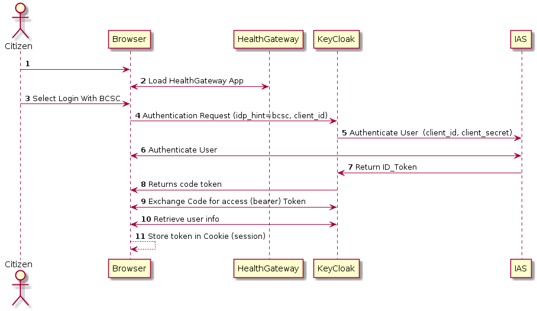

# High-Level Health Gateway Architecture

## Citizen Authentication using OAuth2 OpenID Connect (OIDC) Flow

The Health Gateway is designed to use external identity providers (IdPs) integrated through KeyCloak (RedHat SSO). The principle and initial IdP for authenticating citizens is IAS using the BC Services Card. IAS is the Identity Assurance Service offered by the BC Ministry of Citizens' Services.

In **Step 1**, the user navigates to the Health Gateway on their browser.  The browser loads the Health Gateway application in **Step 2**. In **Step 3**, the user selects to login using their BC Services Card. **Step 4** submits an authentication request to KeyCloak (RedHat SSO) passing the selected identity provider choice, in this case 'bcsc'.  KeyCloak connects to the IAS, a provisioned Identity Provider (IdP), and in **Step 5**. KeyCloak submits an OAuth2 OIDC authentication request.

In **Step 6**, the BC Services Card authentication flow takes over. The user follows a standard interaction for authenticating with their BC Services Card, most commonly executed using the BC Services Card mobile app. The user experience and flow is the same as experienced connecting to https://id.gov.bc.ca/account.

In **Step 7**, upon a successful login by the Citizen with their BCSC, IAS returns the id_token, a JSON Web Token for the authenticated user. In **Step 8**, KeyCloak returns an authorization code back to the client application (HealthGateway running in the Citizen's browser).  Followin normal Oauth code flow, the client app exchanges the authorization code for the bearer token of the authenticated user in **Step 9**.  

Optionally, in **Step 10**, the client app retrieves userInfo by making an explicit call to the KeyCloak server. This retrieves any additional user detail collected as part of the registration flow but not provided from the basic auth flow to BCSC.  

The last step, **Step 11** the user's JWT or bearer token is stored in session in the Browser to avoid repeatedly asking for the user to authenticate themselves. This is deleted upon logout.

## Example Access control of Medications API

The Health Gateway is composed of publicly accessible but protected service APIs that fetch Medications data and other health records. This example flow illustrates the protections of those APIs. An HTTP Not Authorized '401' Error is returned whenever sufficient access is not met. 

## Citizen as Patient

By default, citizens will have access to their own health data and other Health Gateway user related information. The authorization is managed by user identity attribute from the BC Services Card to resolve to the user's Personal Health Number, or PHN. The PHN is not persisted anywhere within the Health Gateway application and that is by design.

## 

## User Managed Access  (Using UMA 2.0)
