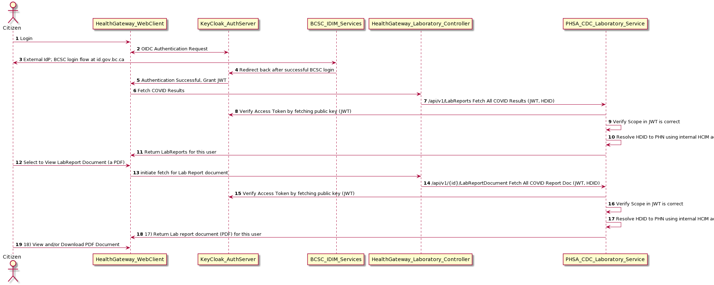

# PHSA CDC Laboratory Integration
8 May 2020.
The BC Center for Disease Control is performing COVID-19 lab tests. The results of which will be available to citizens of BC through the HealthGateway.

To achieve this, PHSA has stood up a set of RESTful services protected by the citizen credentials obtained through authentication authorization on the HealthGateway.

Like any protected resource server, the logial resource owner is the citizen. The endpoint will only provide the lab test results when the following OAuth2 assertions are true:

1. The JWT passed to the service is valid by verifying the digital signature by way of the HealthGatway's Keycloak public key.
2. That the JWT contains a valid subject identifier that correlates to the personal health number found in the lab results. This is determined the service integrating to the BC HCIM services.
3. That the JWT contains the correct audience and scope requests for a lab observation query.

Only the resource owner, at this point, can query for their lab results through this API. The current solution does not support UMA 2.0 and delegation.

## Typical flow

  
### Steps
In **Step 1**, the user starts login to Health Gateway web application.  In **Step 2**, the OIDC flow begins redirecting the user to login using their BCSC. In **Step 3**, the user completes their authentication with BC Services Card. **Step 4**  id.gov.bc.ca redirects back to  KeyCloak (RedHat SSO).  **Step 5** the login is completed an a Json Web Token (JWT) is stored in the browser's cookie storage for the session. 

Now that the user is authenticated, the app then sets out to retrieve results into their timeline view. Once loaded, the application will direct the user's attention to COVID-19 retuls if available. In **step 6** the application initates the fetch. The backend Laboratory_Controller accepts the valid JWT and calls the PHSA CDC service in **step 7**.

The PHSA_CDC Laborotory Service recognizes and understands how to accept JWTs issued by the Health Gateway. In **step 8** the service, like any service using stateless JWT authorization, checks that the JWT is valid and checks it by retrieving the public key from the Keycloak Server. Validation includes checking the expiry date. **step 9** and **step 10**, the service checks that the correct scope is provided, in this case that the HL7 FHIR compliant scope of patient/Observation.read is availabe in the JWT.  Only then will it proceed to resolve the JWT-provided HDID to PHN by calling to the BC HCIM Client Registry (not detailed).

In **step 11**, the PHSA CDC Laboratory service returns the JSON lab result, which is described in the swagger API documentation (see below).

At this point, the timeline now has the laboratory results and the user can see the details. Within the details is a link to retrieve the Lab Result Document, a PDF document. In **step 12**, the user taps on the link to retrieve the report.  In **step 13**, the HealthGateway Laboratory_Controller receives the user's JWT, makes sure it is all good, and then forwards the request to the PHSA CDC LabResults Service in **step 14**.  Like before, the PHSA service verifies the JWT and resolves the PHN for the document retrieval in **steps 15** through **step 17**.

Finally, in **step 18**, the document is returned to the HealthGateway web application, and in **step 19**, the user views or selects to download the document.

## PHSA CDC Laboratory API documentation

The preliminary documentation is available at <https://phsahealthgatewayapi.azurewebsites.net/swagger/index.html>
